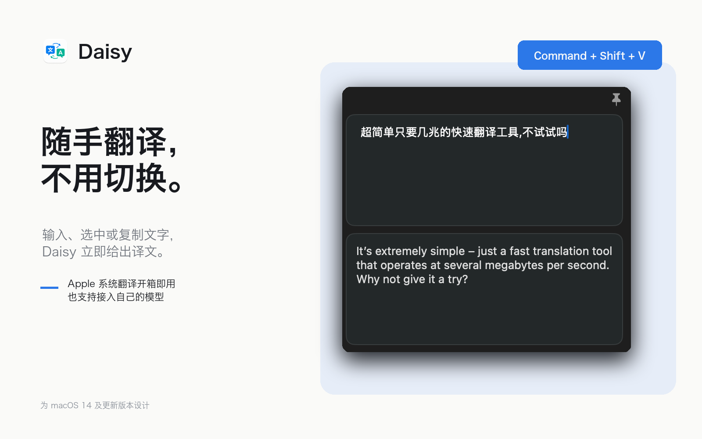
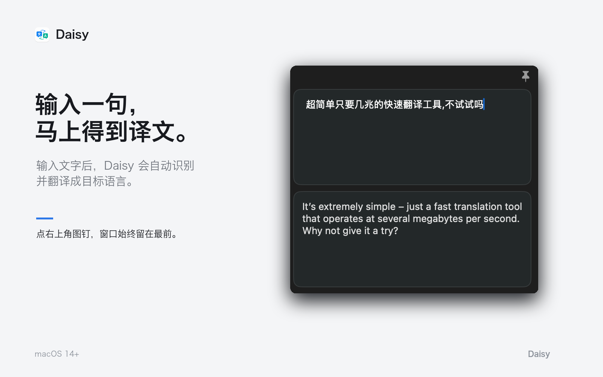
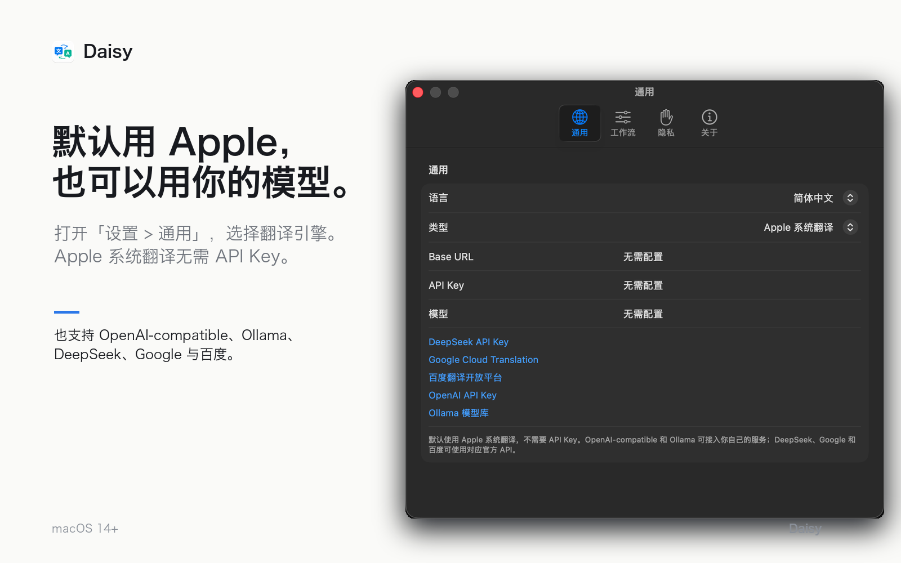
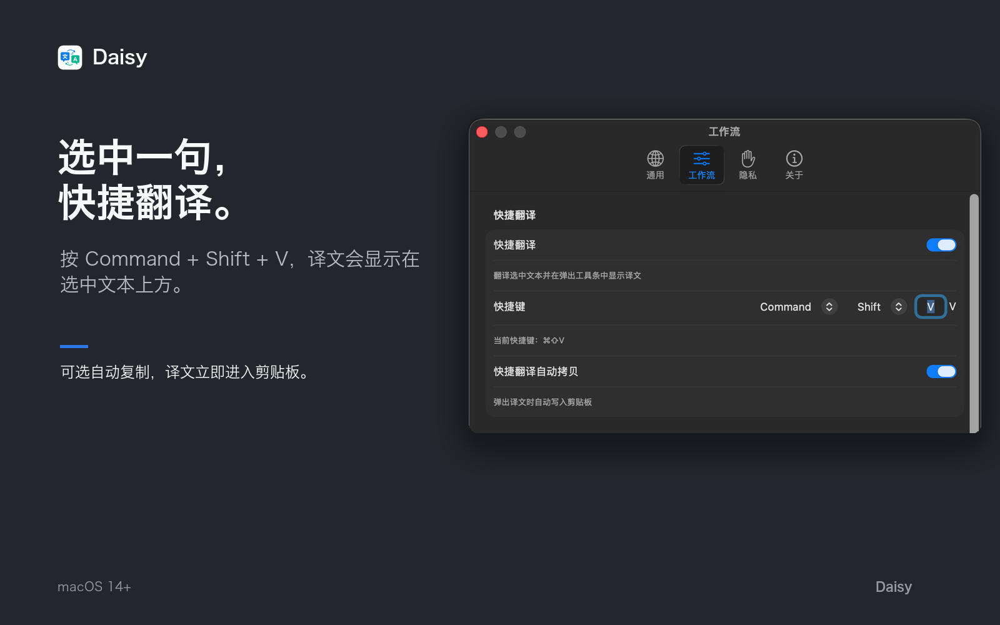
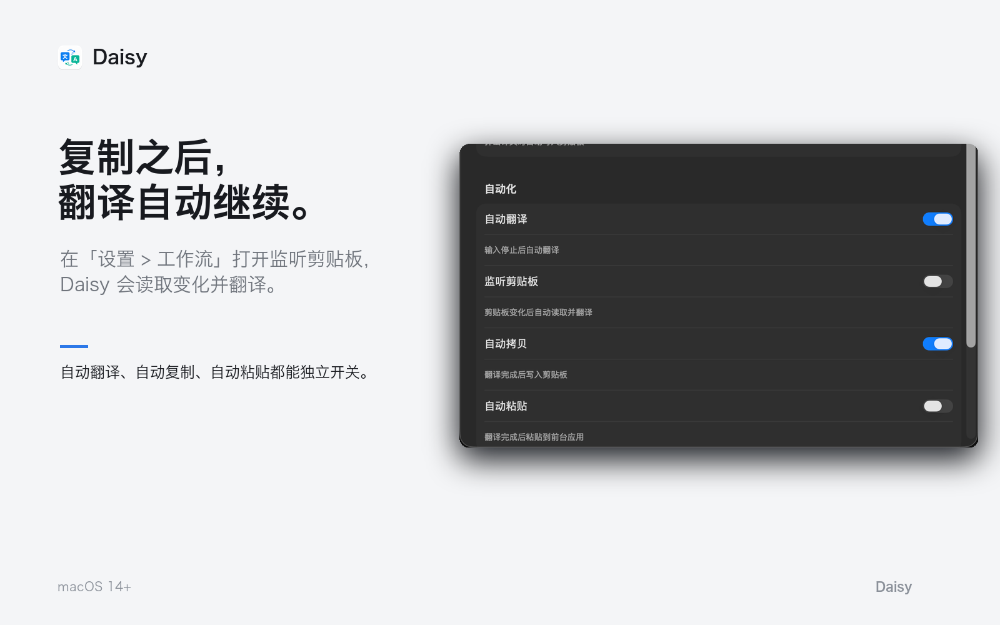
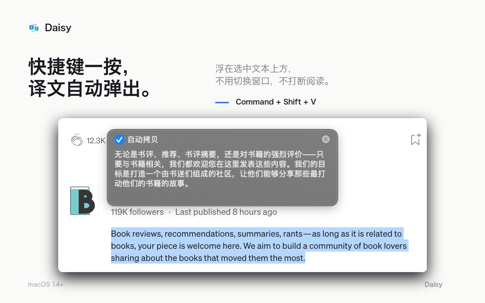

# Daisy

Daisy 是一款轻量、原生的 macOS 翻译工具，专注于快速、安静地完成日常翻译。它常驻菜单栏，需要时立即出现，不需要时不会打断工作。

## 核心功能

- 自动识别中文和英文，并翻译为另一种语言
- 支持 Apple 系统翻译以及多种常用翻译服务
- 通过全局快捷键翻译剪贴板或当前选中的文字
- 支持自动翻译、自动复制和自动粘贴
- 普通窗口与极简模式自由切换
- 窗口置顶和透明度调节
- 中英文界面，可跟随系统语言
- 本地翻译历史，支持搜索、复制和删除

## 使用体验

Daisy 可以作为普通窗口使用，也可以切换到更紧凑的极简模式。菜单栏提供常用开关和目标语言选择，设置修改后即时生效。

快捷翻译可以直接读取当前选中的文字，并在附近显示译文；剪贴板监听则适合连续处理多段内容。

## 功能展示

### 输入即翻译，窗口随时置顶

### Apple 系统翻译或自定义翻译引擎

### 选中文字，快捷翻译

### 监听剪贴板，自动完成连续翻译

### 译文就地弹出，不打断阅读

## 隐私

- 翻译历史只保存在本机
- 服务凭证保存在 macOS 登录钥匙串中
- Daisy 不会主动上传翻译历史
- 只有使用需要辅助功能的快捷操作时，才会请求相应的系统权限

## 系统要求

macOS 14 或更高版本。
